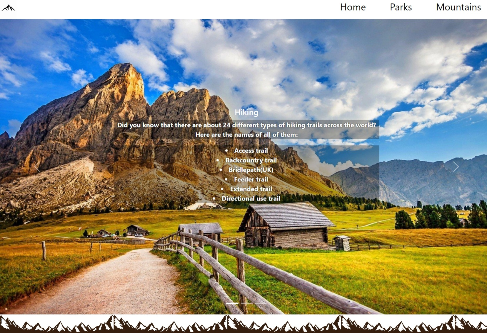
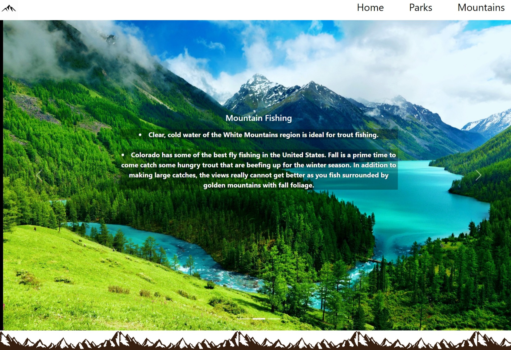
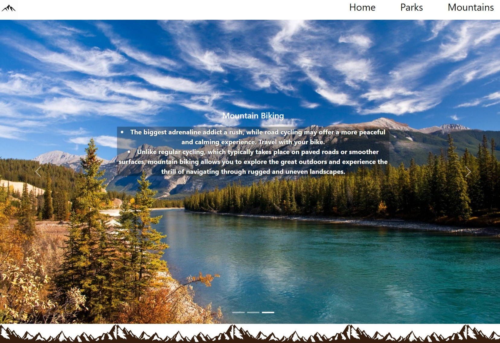
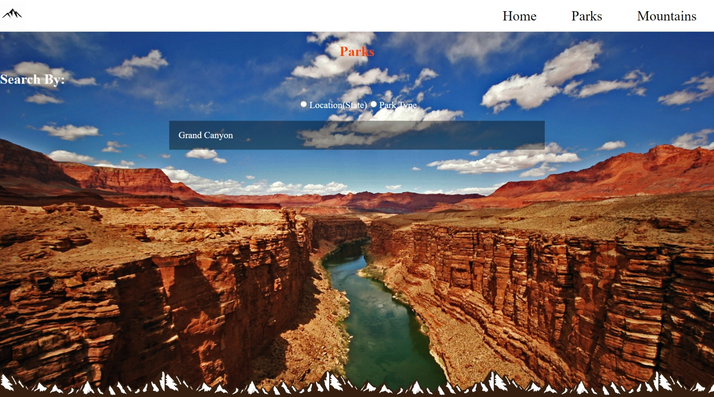
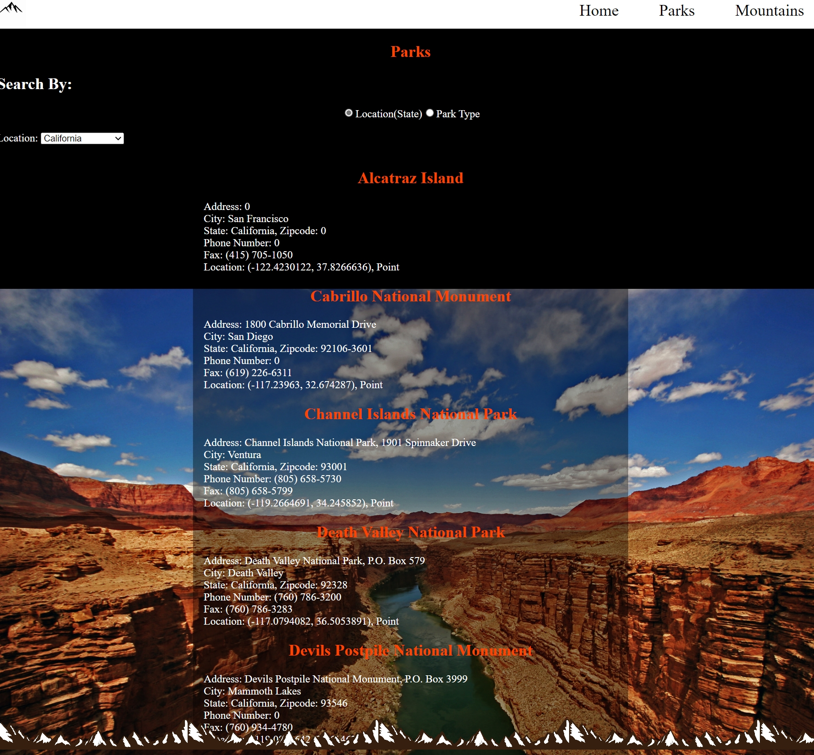

# National Parks & Mountains

## Home Page
Home page gives a few facts on each slides about different activities that can be on done, if you scroll down a bit you will see the mountain footer.
 
 

## My Parks Page
The Parks Page gives a clean img of the Grand Canyon background with radios to search the location or even the park type ended with a mountain footer, the color patterens I used is for they particular page.

## My Mountains Page
The Mountain Page is topped with a nice clean background of the Himalayan Mountains with a mountain footer, this page is used to search mountains and it gives some info on that particular mountain of your choosing.

## LIVE VISUAL LINK
